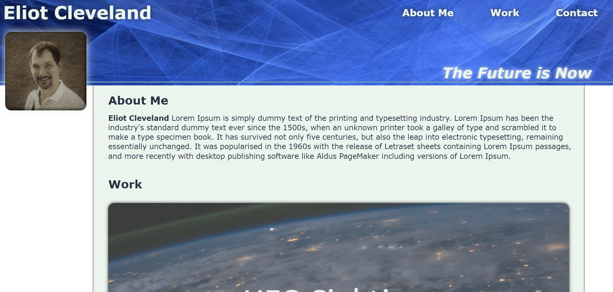
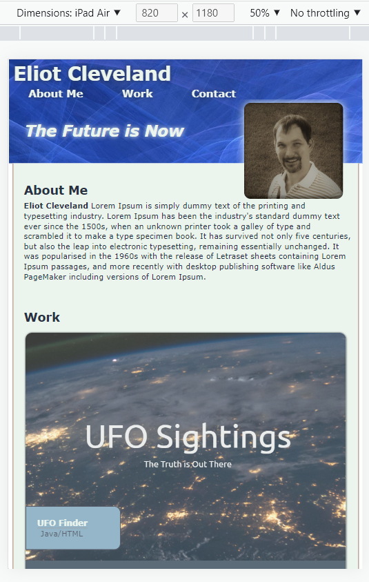
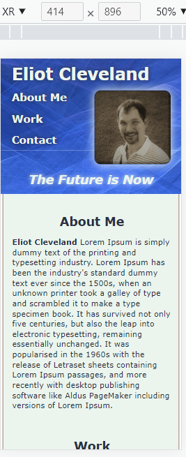

# Porfolio
### Professional showcase for my projects to date
Here is the Desktop view:

## Link

https://eclevela-1234.github.io/Porfolio/

## Steps
* Build file structure and Sketch Wire frame (insert picture below) 6/2/22
* Build HTML skeleton with semantic elements and some classes
* Choose Hero/Profile Images and add Placeholder images
* Position divs and style elements using CSS
* Add in Media Queries and other responsive elements

### Here are additional screen size views
 

## Final Thoughts
* First start-from-scratch assignment of the boot camp was a challenge!
* I gave myself plenty of time to fine tune but still ran up against the clock
* I am overall happy with the funtionality but design element/colochoices could use a re-work - it really never ends
* I tripped quite a few times but got back up. I am confident that it will go smoother in the future!
